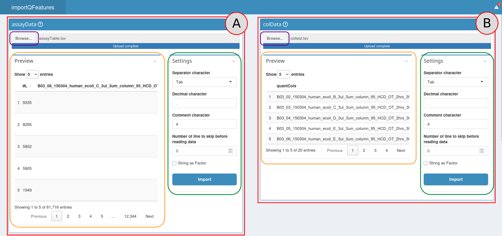

# importQFeatures App

## Create a QFeatures object

A view of the import section.

### Table imports

The first step to create a QFeatures object is to provide two tables:

- An assayData table: the assayData table is generated after the
  identification and quantification of the MS spectra by preprocessing
  software such as MaxQuant, Proteome Discoverer, or MSFragger.

- A colData table: the colData table contains the experimental design
  generated by the researcher. The rows of the colData table correspond
  to a sample in the experiment and the columns correspond to the
  available annotations about the sample.

More information about these tables can be found in the documentation of
the [function
`readSCP`](https://uclouvain-cbio.github.io/scp/articles/read_scp.html)
from the scp package.

To provide the Input Table, use the Input Table box (red box `A`). Press
the `Browse…` button (orange box), then choose the appropriate `.csv` or
`.tsv` file on your computer. Once the file has been selected, the path
to it is visible next to the `Browse…` button.

Then look at the Parameters section (purple box). Choose the appropriate
options to import your file (see the [read.table
documentation](https://www.rdocumentation.org/packages/utils/versions/3.6.2/topics/read.table)
for more information):

- `separator character` (default = “,”)

- `decimal character` (default = “.”)

- `comment character` (default = “#”)

- `number of lines to skip before reading the file` (default = 0)

- `strings as factors` (default = FALSE)

Once all these options are selected for your file, click on the `Import`
button. Your table is now visible in the Preview box (green box); make
sure it is well formatted before continuing.

The process to import the Sample Table is identical, but this time use
the Sample Table box (red box `B`).

### QFeatures conversion

A view of the conversion and download sections.

The QFeatures converter tool is available on the right side of the
application in the QFeatures Converter box (`C`). The first step to
perform a QFeatures conversion is to define the columns that will be
used to create the links between the two tables. This can be done in the
Parameters box (purple box):

- `batch column`: The column of the Input table and the Sample table
  that contains the batch names.

- `channel column`: The column of the Sample table that contains the
  column names of the quantitative data in the Input table.

If the Sample table has correctly been imported, the column names will
be available in the drop-down list. Select for each drop-down list the
appropriate column. An option to remove, in each batch, the columns that
contain only missing values is also available using a checkbox. More
information about these parameters can be found in the [readSCP
documentation](https://uclouvain-cbio.github.io/scp/articles/read_scp.html).

Once everything is correctly set up, press the
`Convert to a QFeatures object` button.

### QFeatures object export

A QFeatures Preview panel is now visible in the Preview QFeatures box
(`D`). Check with this preview whether the conversion process went fine.
By clicking on a row (corresponding to an assay), the selected assay
will appear below, once again check if everything looks as expected.

Once everything looks fine, you can download the QFeatures object to use
it with R or continue the analysis using the
[`processQFeatures()`](https://uclouvain-cbio.github.io/QFeaturesGUI/reference/processQFeatures.md)
function.

To download, click on the `Download` button (`E`); this will download a
`.zip` file containing *initial_QFeatures.rds*, the QFeatures object on
your computer, *importQFeatures_script.R* corresponding to the code
lines used to generate the QFeatures object, and
*initial_QFeatures_sessionInfo.html* containing a view of all packages
and versions used to generate the QFeatures object. Choose the
destination folder and the folder name, then click on save. Your
QFeatures object is now available on your computer, it can be used in
combination with the scp package to continue the data processing.
