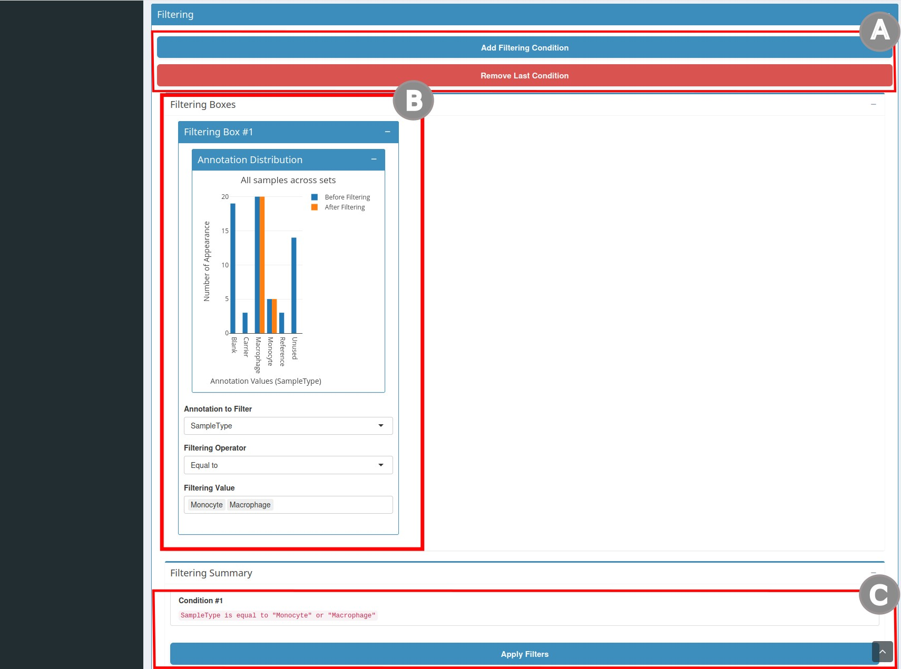
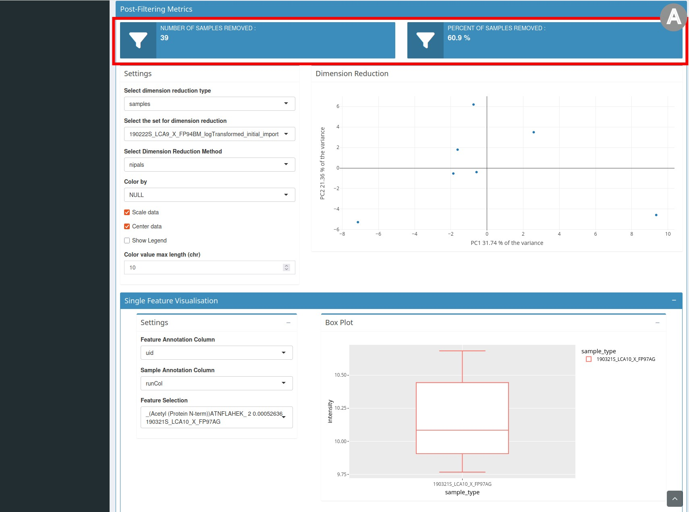
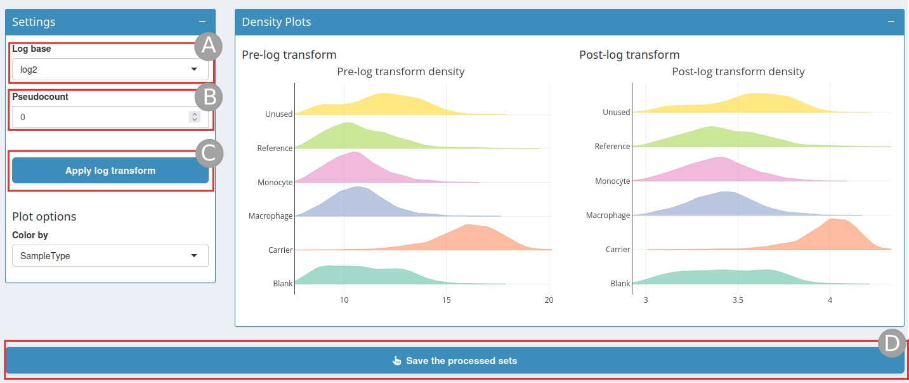
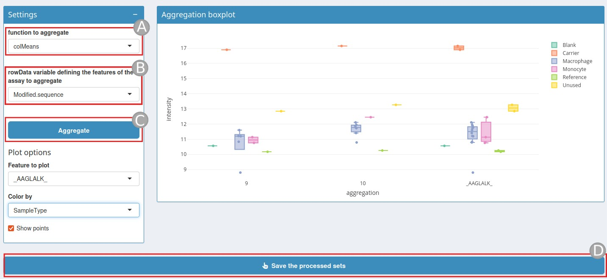
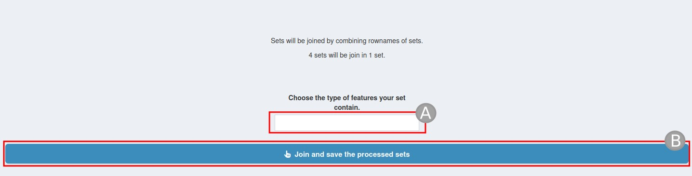

# processQFeatures App

## Start the app

Parameters of the shiny application :

- `qfeatures`: a QFeatures object this can be either a path to an rds
  file or a QFeatures object already loaded in your R session.

- `prefilledSteps`(optional): define the different steps of the workflow
  use to analyze the QFeatures object, accepted values are
  `sampleFiltering`, `featureFiltering`, `normalisation`,
  `missingValuesFeatures`, `missingValuesSamples`, `zeroToNA`,
  `logTransform`, `imputation`, `aggregation` and `join`. The suggested
  workflow set as default value is `sampleFiltering`,
  `featureFiltering`, `missingValuesFeatures`, `missingValuesSamples`,
  `normalisation`,`aggregation`, `join` and `aggregation`.

- `initialSets`(optional): Sets to use for the analysis of the QFeatures
  object. Default is set to `seq_along(qfeatures)`.

## Workflow configuration

A predefined workflow is defined by default with the argument
`prefilledSteps`, if `prefilledSteps` was modified when the application
was launched this change will be taken in account.

On the page there is a brief explanation of each step. To modify the
workflow, drag and drop the different steps to be executed onto the
QFeatures object. Once the workflow is configured you can click on
`Confirm Current Workflow`.

If the default workflow is the one you want to use or if you have
already specified the desired workflow in `prefilledSteps` parameter,
simply click on `Step 1`.

## Sample/Feature Filtering

### Pre-Filtering Metrics section

pre-Filtering metrics section

`pre-Filtering metrics` section (Figure 1) is composed of two different
part :

- a dimension reduction graph (`B`) on the right and the settings (`A`)
  to customize this graph on the left, you can for example choose the
  dimensionality reduction method or the type of dimensionality
  reduction.

- a single feature visualization (`C`) where you can display a boxplot
  of a selected feature split by sample annotation.

### Filtering section

filtering section

- the second section is `Filtering` (Figure 2). To create a condition
  click `Add Filtering Condition` (`A`). Clicking this button will open
  the `filtering boxes` (`B`). In this box you can add filtering
  conditions. Once you have chosen the annotation and the value to
  filter you will dynamically see the number of cells that will be
  filtered. You will also find a summary of the selected conditions.
  Once the filters are chosen click `Apply Filters` (`C`). If a
  condition is unnecessary you can also click on `Remove last condition`
  (`A`).

### Post-filtering Metrics section

post-Filtering metrics section

- the third section entitled `post-Filtering metrics` (Figure 3) repeats
  the elements of the `pre-Filtering metrics` section but the graph
  presents the data after filtering. It also contains statistics on the
  number and percentage of samples/features removed.

Once the filtering has been done, save the object by clicking the button
`Save the processed sets`.

## Filtering missing values by samples/features

Filtering missing values by samples/features page

Missing values can be very numerous in certain proteomics experiments
and need to be dealt with carefully.

In this step you will need to define a threshold for the percentage of
missing value (NA) beyond which a feature/sample should be removed
(`A`). By changing this value, the statistics relating to the number and
percent of features/samples removed (`B`) and the associated graph (`C`)
will be automatically updated. Once the threshold is defined click on
`Save the processed sets` (`D`).

## Normalisation

Normalization page

QFeatures object can be normalised on this step. Several normalization
methods are available (`A`).

- `sum` and `max`, where each feature’s intensity is divided by the
  maximum or the sum of the feature respectively. These two methods are
  applied along the features (rows).

- `center.mean` and `center.median` center the respective sample
  (column) intensities by substracting the respective column means or
  medians. `div.mean` and `div.median` divide by the column means or
  medians.

- `diff.median` center all samples (columns) so that they all match the
  grand median by substracting the respective columns medians
  differences to the grand median.

- Using `quantiles` or `quantiles.robust` applies (robust) quantile
  normalisation, as implemented in
  `preprocessCore::normalize.quantiles()` and
  `preprocessCore::normalize.quantiles.robust()`. `vsn` uses
  `vsn::vsn2()` function. Note that the latter also glog-transforms the
  intensities. See respective manuals for more details and functions
  arguments.

Once the normalisation method is selected click on `Apply normalisation`
(`B`), the density graph after normalization will be displayed. Click on
`Save the processed sets` (`C`).

## Zero to NA

Zero to NA page

This step convert all zero intensities into missing values (NA) in the
selected sets.

## Log Transformation

Log transformation page

When analysing continuous data using parametric methods (such as t-test
or linear models), it is often necessary to log-transform the data.

The Log base is by default set to `log2`, but can also be set to `log10`
and `ln` (`A`), a pseudocount value can be added (`B`) to handle zero
values in data before applying logarithm. Then click on
`Apply log transform` (`C`), this will display a density plot post log
transformation. Once this is done do not forget to click on
`Save the processed sets` (`D`).

## Imputation

Imputation page

There are two types of mechanisms resulting in missing values in LC/MSMS
experiments.

- Missing values resulting from absence of detection of a feature,
  despite ions being present at detectable concentrations. For example
  in the case of ion suppression or as a results from the stochastic,
  data-dependant nature of the MS acquisition method. These missing
  value are expected to be randomly distributed in the data and are
  defined as *missing at random* (MAR) or *missing completely at random*
  (MCAR)

- Biologically relevant missing values, resulting from the absence of
  the low abundance of ions (below the limit of detection of the
  instrument). These missing values are not expected to be randomly
  distributed in the data and are defined as *missing not at random*
  (MNAR).

See [Imputing quantitative proteomics
data](https://rformassspectrometry.github.io/QFeatures/articles/Imputation.html)
for more informations.

First choose an imputation method (`A`):

- `knn` : Nearest neighbour averaging, as implemented in the
  [`impute::impute.knn`](https://www.bioconductor.org/packages/release/bioc/html/impute.html)
  function. Note that this function is used with default parameters.

- `MinDet` : Performs the imputation of left-censored missing data using
  a deterministic minimal value approach. Considering an expression data
  with `n` samples and `p` features, for each sample, the missing
  entries are replaced with a minimal value observed in that sample. The
  minimal value observed is estimated as being the q-th quantile
  (default q = 0.01) of the observed values in that sample. Implemented
  in the
  [`imputeLCMD::impute.MinDet`](https://rdrr.io/cran/imputeLCMD/man/impute.MinDet.html).
  Note that this function is used with default parameters.

- `zero` : Replaces the missing values with 0.

Then click on `Apply imputation` (`B`), once the imputation has run the
page will display a Post-imputation density plot which you can color by
colData (`C`). Once the imputation step is finished, do not forget to
`Save the processed sets` (`D`).

## Aggregation

Aggregation page

At this stage, it is possible to use the peptide-level intensities or
aggregate the peptide-level data into protein intensities.

To do this, a quantitative feature aggregation function is required.
This function, called `function to aggregate` (`A`) takes a matrix as
input and returns a vector of length equal to `ncol(x)`. The functions
can be one of the following types :

- [`MsCoreUtils::medianPolish()`](https://rdrr.io/pkg/MsCoreUtils/man/medianPolish.html)
  to fits an additive model (two way of decomposition) using Tukey’s
  median polish_procedure using
  [`stats::medpolish()`](https://rdrr.io/r/stats/medpolish.html).

- [`MsCoreUtils::robustSummary`](https://rdrr.io/pkg/MsCoreUtils/man/robustSummary.html)
  to calculate a robust aggregation using
  [`MASS::rlm()`](https://rdrr.io/pkg/MASS/man/rlm.html) (default).

- [`base::colMeans()`](https://rdrr.io/r/base/colSums.html) to use the
  mean of each column.

- [`matrixStats::colMedians()`](https://rdrr.io/pkg/matrixStats/man/rowMedians.html)
  to use the median of each column.

- [`base::colSums()`](https://rdrr.io/r/base/colSums.html) to use the
  sum of each column.

See
[`MsCoreUtils::aggregate_by_vector()`](https://rdrr.io/pkg/MsCoreUtils/man/aggregate.html)
for more aggregation functions.

A rowData variable (`B`) is also needed defining how to aggregate the
features of the assays.

Once these two variable has been set click on `Aggregate` (`C`).

An aggregation boxplot will be display. This boxplot shows a feature
color by a value of the colData Once the aggregation is done click on
`Save the processed sets`.

## Join

Join page

Join tab will combine the results from the previous step into a single
dataset for further analysis or export. Simply give it a new assay name
(`A`). Then click `Join and save the processed sets` (`B`).

## Summary

Summary page

The summary page display the various assays present in the QFeatures
object and indicates their interrelationships. Finally a download button
provide a zip file containing the final QFeatures object the script used
to generate it, and the Rsession with the package version.
