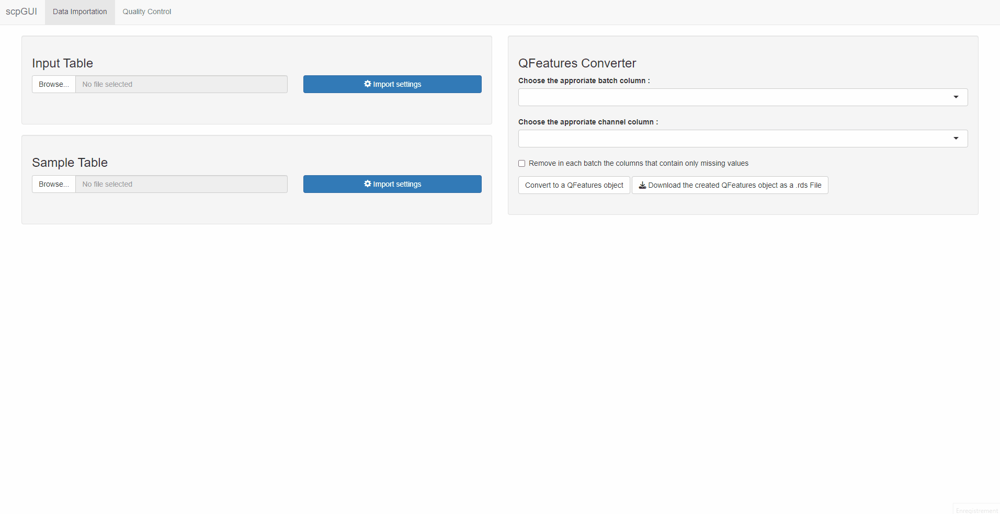
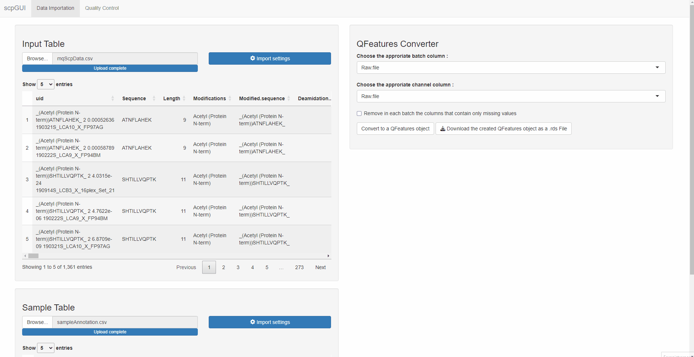
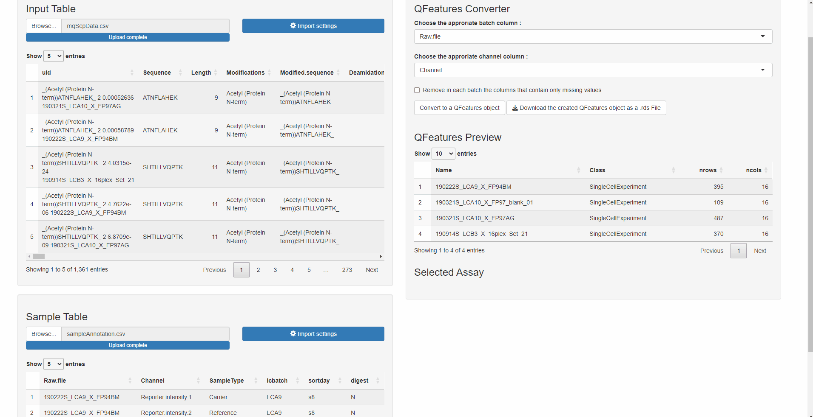

```{r, include = FALSE}
knitr::opts_chunk$set(
    collapse = TRUE,
    comment = "#>"
)
```

# Create a QFeatures object
Once the application has been launched, the window will look like this:

{width="700"}

For this demonstration, the data from the scp package will be used. The following code allows to retrieve the needed data sets.

```{r, eval = FALSE}
library(scp)
data("mqScpData")
data("sampleAnnotation")

write.csv(mqScpData, file = "mqScpData.csv") # Corresponds to the Input Table
write.csv(sampleAnnotation, file = "sampleAnnotation.csv") # Corresponds to the Sample Table
```

## Table imports

The first step to create a QFeatures object is to provide two tables:

-   An Input Table: The input table is generated after the identification and quantification of the MS spectra by a pre-processing software such as MaxQuant, ProteomeDiscoverer or MSFragger .

-   A Sample Table: The sample table contains the experimental design generated by the researcher. The rows of the sample table correspond to a sample in the experiment and the columns correspond to the available annotations about the sample.

More information about these tables can be found in the documentation of the function readSCP() from the scp package.

To provide a table, press the `Browse…` button then choose the appropriate `.csv` or `.tsv` file on your computer. Once the file has been selectioned, the path to it is visible next to the `Browse…` button.

When pressing the `Import settings` button, a new window will appear. Choose the appropriate options to import your file (see read.table() documentation for more information):

-   `separator character` (default = ",")

-   `decimal character` (default = ".")

-   `comment character` (default = "\#")

-   `number of lines to skip before reading the file` (default = 0)

-   `strings as factor` (default = FALSE)

Once all these options are selected for your file, click on the `Import` button and close the window. Your table is now visible on the interface, make sure it is well formatted before continuing.

The process to import both tables is identical.

{width="700"}

## QFeatures conversion

The QFeatures converter tool is available on the right side of the application. The first step to perform a QFeatures conversion is to define the columns that will be used to create the links between the two tables:

-   `batch column`: The column of the Input table and the Sample table that contains the batch names.

-   `channel column`: The column of the Sample table that contains the column names of the quantitative data in the Input table

If the Sample table has correctly been imported, the column names will be available in the drop-down list. Select for each drop-down list the appropriate column. An option to remove in each batch the columns that contains only missing values is also available using a checkbox.

Once everything is correctly setup, press the `Convert to a QFeatures object` button, a loading menu will appear. If an error occurred during the conversion, an error message will pop up below the Convert button, refer to the readSCP() function to find the origin of the error. If everything went well, a notification will appear with a "conversion succeed" message.

{width="700"}

## QFeatures object export

A QFeatures Preview panel is now available below the QFeatures converter tool. Check with this preview if the conversion went fine. By clicking on a row (corresponding to an assay), the selected assay will appear below, once again check if everything looks as expected.

Once everything looks fine, click on the `Download` button, this will download a `.rds` file containing the QFeatures object on your computer. Choose the destination folder, the name of the file and click on save. Your QFeatures object is now available on your computer, it can be used in combination with the scp package to continue the data processing.

{width="700"}