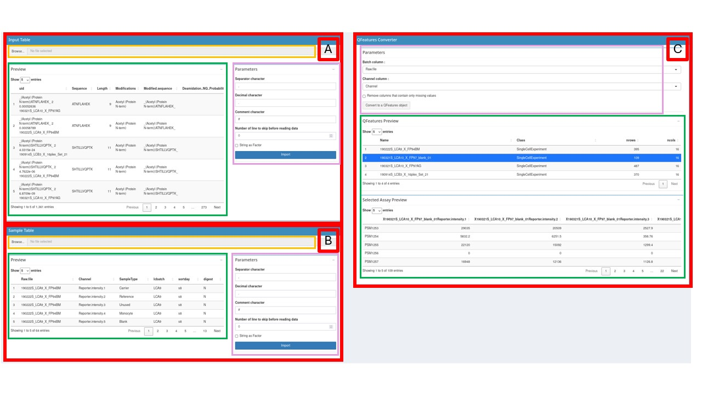

```{r, include = FALSE}
knitr::opts_chunk$set(
    collapse = TRUE,
    comment = "#>"
)
```

# Create a QFeatures object



## Table imports

The first step to create a QFeatures object is to provide two tables:

- An Input Table: The input table is generated after the identification and quantification of the MS spectra by a pre-processing software such as MaxQuant, ProteomeDiscoverer or MSFragger .

- A Sample Table: The sample table contains the experimental design generated by the researcher. The rows of the sample table correspond to a sample in the experiment and the columns correspond to the available annotations about the sample.

More information about these tables can be found in the documentation of the [function `readSCP`](https://uclouvain-cbio.github.io/scp/articles/read_scp.html) from the scp package.

To provide the Input Table, use the Input Table box (red box `A`). Press the `Browse…` button (orange box) then choose the appropriate `.csv` or `.tsv` file on your computer. Once the file has been sectioned, the path to it is visible next to the `Browse…` button.

Then look at the Parameters section (purple box). Choose the appropriate options to import your file (see the [read.table documentation](https://www.rdocumentation.org/packages/utils/versions/3.6.2/topics/read.table) for more information):

- `separator character` (default = ",")

- `decimal character` (default = ".")

- `comment character` (default = "\#")

- `number of lines to skip before reading the file` (default = 0)

- `strings as factor` (default = FALSE)

Once all these options are selected for your file, click on the `Import` button. Your table is now visible on the Preview box (green box), make sure it is well formatted before continuing.

The process to import the Sample Table is identical, but this time use the Sample Table box (red box `B`).

## QFeatures conversion

The QFeatures converter tool is available on the right side of the application in the QFeatures Converter box (red box `C`). The first step to perform a QFeatures conversion is to define the columns that will be used to create the links between the two tables. This can be done in the Parameters box (purple box):

- `batch column`: The column of the Input table and the Sample table that contains the batch names.

- `channel column`: The column of the Sample table that contains the column names of the quantitative data in the Input table

If the Sample table has correctly been imported, the column names will be available in the drop-down list. Select for each drop-down list the appropriate column. An option to remove in each batch the columns that contains only missing values is also available using a checkbox.
More information about these parameters can be found in the [readSCP documentation](https://uclouvain-cbio.github.io/scp/articles/read_scp.html)

Once everything is correctly setup, press the `Convert to a QFeatures object` button.

## QFeatures object export

A QFeatures Preview panel is now visible in the Preview QFeatures box (green box). Check with this preview if the conversion process went fine. By clicking on a row (corresponding to an assay), the selected assay will appear below, once again check if everything looks as expected.

Once everything looks fine, you can continue the analysis using scpGUI (the QFeatures object will be available for the other sections of the app) or download the QFeatures to use it with R. 

To download click on the `Download` button, this will download a `.rds` file containing the QFeatures object on your computer. Choose the destination folder, the name of the file and click on save. Your QFeatures object is now available on your computer, it can be used in combination with the scp package to continue the data processing.
